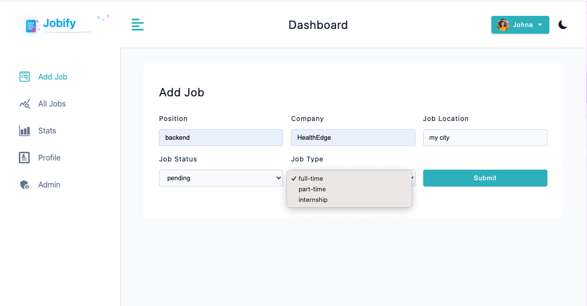
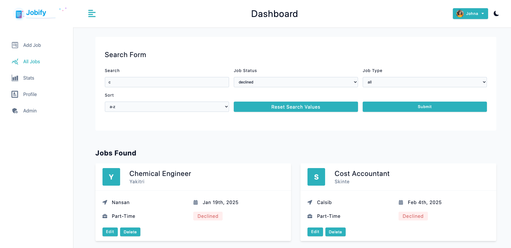
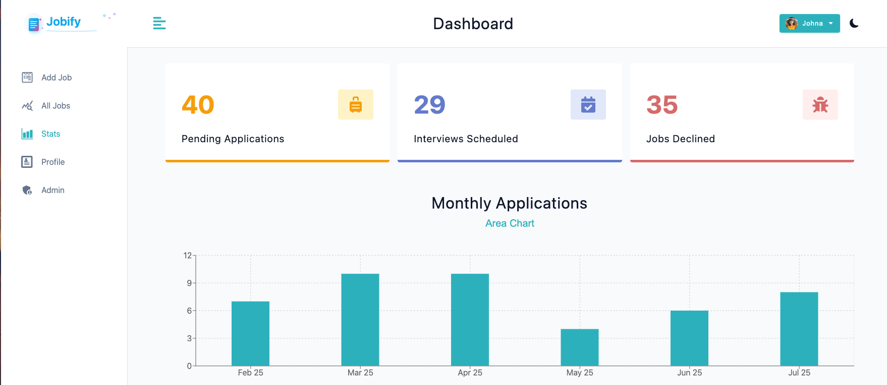

# Jobify - Full Stack Job Tracking Application

A modern job tracking application built with the MERN stack that helps users manage their job search process efficiently.

## 🚀 Live Demo
[View Live Application](https://jobify-my-mern-project.onrender.com)

🧪 Testing
Email:john@gmail.com

Password:secret123


## 📸 Screenshots




## ✨ Features

### User Management
- User registration and authentication with JWT
- Role-based access control (Admin/User)
- Profile management with avatar upload (Cloudinary)
- Demo user functionality for testing

### Job Management
- Full CRUD operations for job applications
- Advanced filtering and search functionality
- Sort by date, position, or company
- Pagination for better performance

### Analytics Dashboard
- Visual statistics with recharts
- Monthly application trends
- Job status overview (pending, interview, declined)
- Interactive charts (Bar & Area charts)

### Technical Features
- Dark/Light theme toggle with persistence
- Responsive design for all devices
- Real-time form validation
- Optimistic UI updates with React Query
- Secure HTTP-only cookies

## 🛠️ Tech Stack

### Frontend
- **React 18** - UI library
- **React Router v6** - Client-side routing with loaders/actions
- **React Query** - Server state management
- **Styled Components** - CSS-in-JS styling
- **Recharts** - Data visualization
- **React Toastify** - User notifications
- **Vite** - Build tool

### Backend
- **Node.js & Express** - Server framework
- **MongoDB & Mongoose** - Database and ODM
- **JWT** - Authentication
- **Bcrypt** - Password hashing
- **Multer & Cloudinary** - File upload handling
- **Express Rate Limit** - API security
- **Helmet** - Security headers

## 🚦 Getting Started

### Prerequisites
- Node.js 16+
- MongoDB Atlas account
- Cloudinary account

### Installation

1. Clone the repository
```bash
git clone https://github.com/yourusername/jobify.git
cd jobify

2. Install dependencies
```bash
npm run setup-project

3 . Environment Variables: Create a .env file in the root directory:
```bash
NODE_ENV=development
PORT=5100
MONGO_URL=your_mongodb_connection_string
JWT_SECRET=your_jwt_secret
JWT_EXPIRES_IN=1d
CLOUD_NAME=your_cloudinary_name
CLOUD_API_KEY=your_cloudinary_key
CLOUD_API_SECRET=your_cloudinary_secret

4. Run the application
```bash
npm run dev


## 📦 Build for Production
```bash
npm run setup-production-app
node server


🧪 Testing
Email:john@gmail.com
Password:secret123


🏗️ Architecture
Frontend Architecture

Component-based architecture with reusable UI components
Context API for global state management
Custom hooks for shared logic
Optimistic updates for better UX

Backend Architecture

RESTful API design
MVC pattern implementation
Middleware for authentication and validation
MongoDB aggregation pipeline for analytics

Security Features

JWT stored in HTTP-only cookies
Password hashing with bcrypt
Input sanitization
Rate limiting on auth routes
CORS configuration
XSS protection with Helmet

📊 API Endpoints
Authentication

POST /api/v1/auth/register - User registration
POST /api/v1/auth/login - User login
GET /api/v1/auth/logout - User logout

Jobs

GET /api/v1/jobs - Get all jobs (with filtering)
POST /api/v1/jobs - Create new job
GET /api/v1/jobs/:id - Get single job
PATCH /api/v1/jobs/:id - Update job
DELETE /api/v1/jobs/:id - Delete job
GET /api/v1/jobs/stats - Get job statistics

Users

GET /api/v1/users/current-user - Get current user
PATCH /api/v1/users/update-user - Update user profile
GET /api/v1/users/admin/app-stats - Admin statistics

